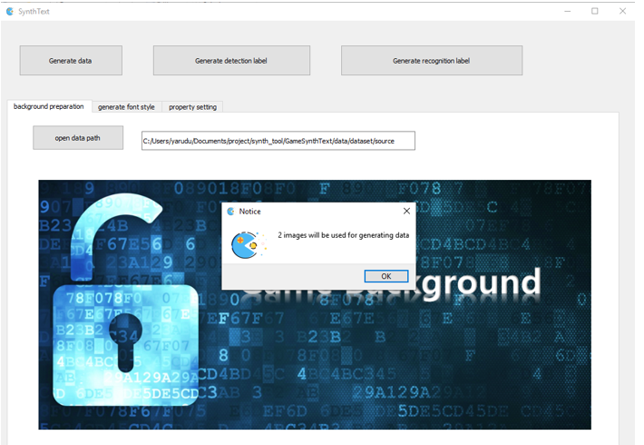
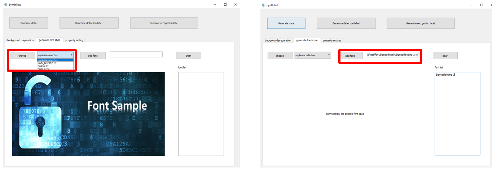
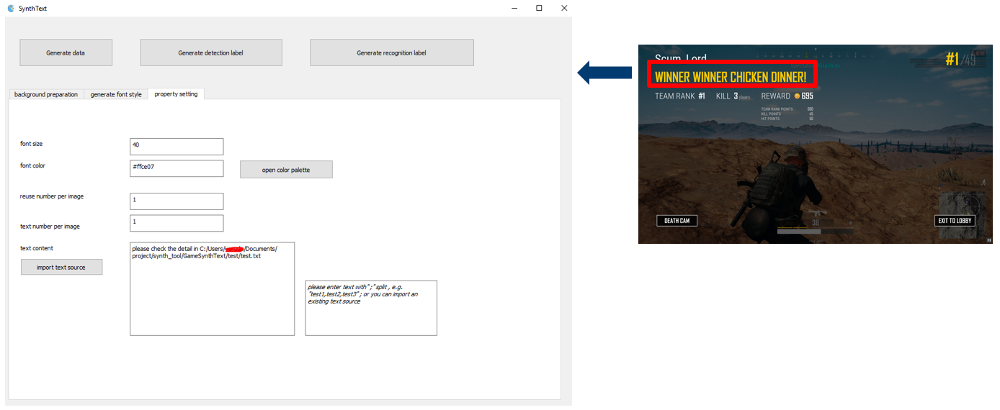
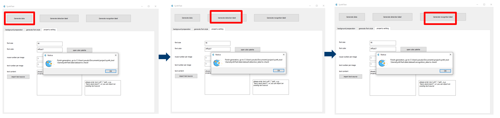
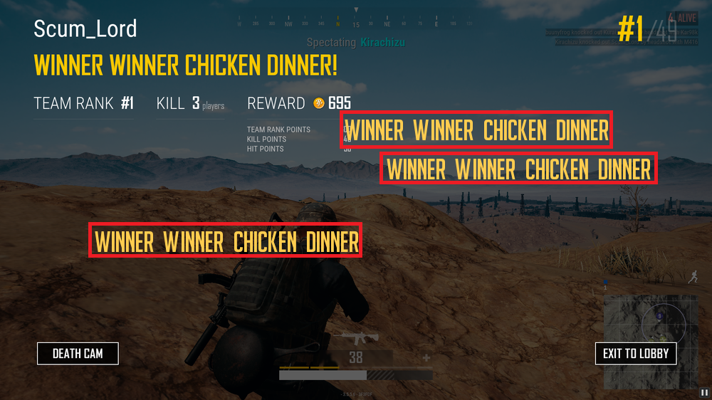
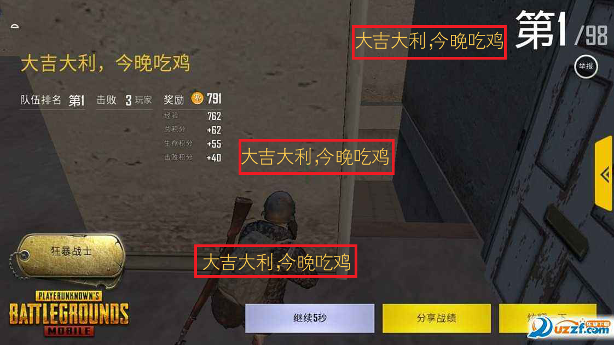

# English Vesrion
This is an revised version from [SynthText](https://github.com/ankush-me/SynthText/) and [Chinese SynthText](https://github.com/JarveeLee/SynthText_Chinese_version), which is more suitable to generate customized data, e.g. generating multiple data same as the text data in game. It works for both Chinese and English.

## Modify 
* The font size, color can be customized 
* UI interface , which is more easier for fresh user
* No font augmentation function, e.g. no border, no shadow 


## Enviroment
* python3, Windows, not sure on Ubuntu

## Run app
`python GUIstart.py`

## Usage Steps 
### Step 1: Prepare background image  
Click `open data path` button, Choose a folder and confirm,the image number under the chosen folder will be popped up as the picture shows  


### Step 2: Select font style by two ways
 1. The first way is to select from the `combobox` which is provided by current tool;
 2. The second way is to click `add font` button and choose the font file  what users want.  
 The chosen font will be listed in `fontlist`. You can clear all the fonts by clicking `clear` button. Deleting one specific font is not supported so far.


### Step 3: Input the character property what you want.   
Here is the example for character “WINNER WINNER CHICKEN DINNER”. Input `40` for the font size , choose color by clicking `open color palette` button, input `1` for the reusing number for each image, input ```1``` for the text number in each image, set the text content by clicking `import text source` button with a `txt` file or entering text directly in the box area.  



### Step 4: Generate data 
Click the button `generate data` , `generate detection label` and `generate recognition label` step by step, it will show the messages as the pictures show.  

 

* detection label format
```
222,230,601,230,601,271,222,271,WINNER WINNER CHICKEN DINNER

#value oder
(left,top) ---> (right,top)
                    |
                    |
                    v
(left,buttom) <--- (right,bottom)
```
* recognition label format
```
test3_000_000.png WINNER WINNER CHICKEN DINNER
```

## Visualization
Here is the example after `Usage Steps`   
 


# 中文
这是基于[SynthText](https://github.com/ankush-me/SynthText/)和[Chinese SynthText](https://github.com/JarveeLee/SynthText_Chinese_version)进行修改的项目，适用于生成自定义数据，如生成大量跟游戏文字相同的数据。 它适用于中文和英文。

## 主要修改
* 生成定制化文本数据，指定字体大小、颜色等
* 增加UI交互，方便操作
* 删除字体增强功能，没有对字体渲染阴影，边框等

## 可视化
 


